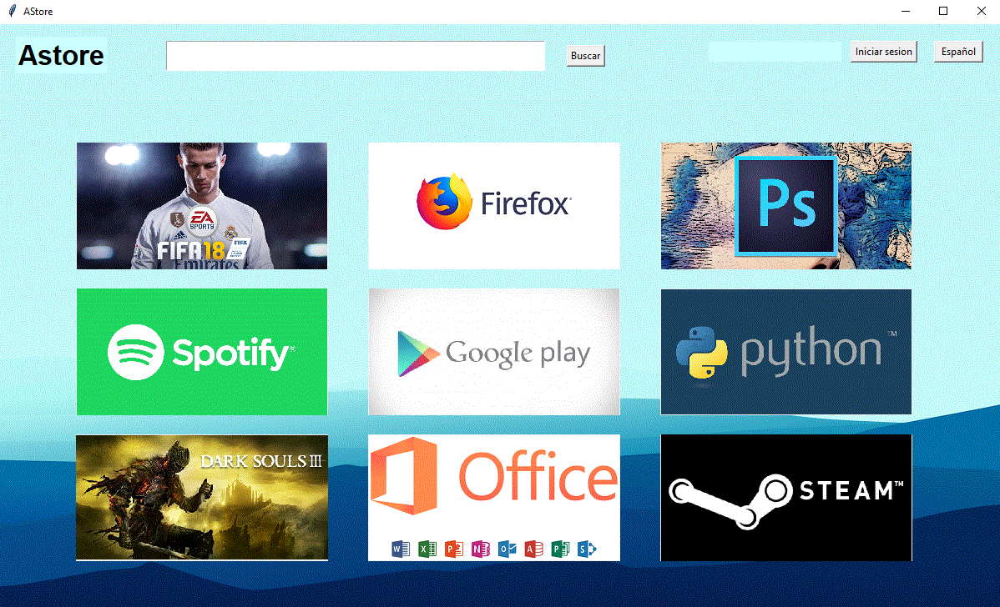
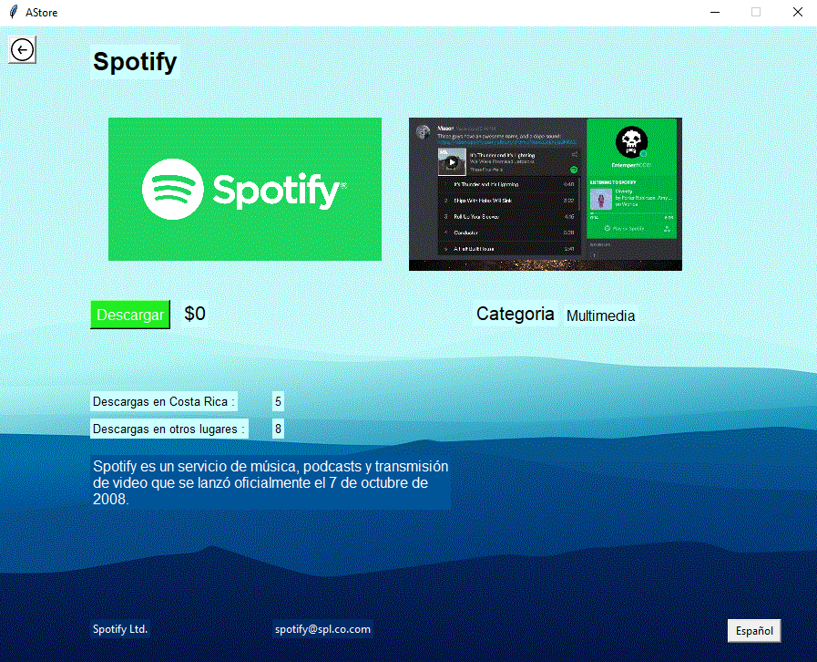
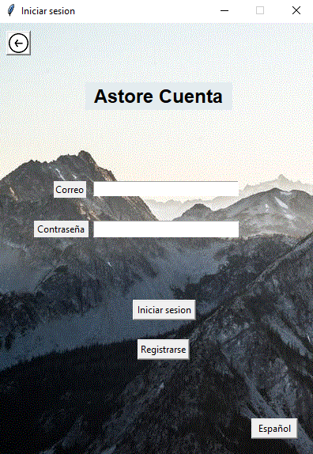
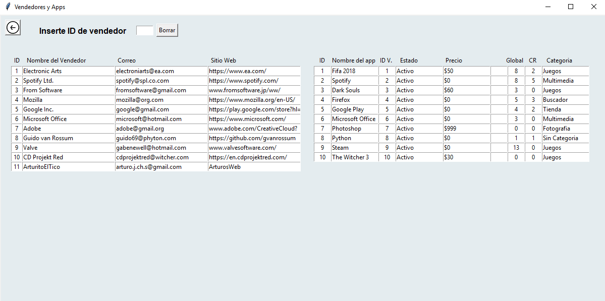
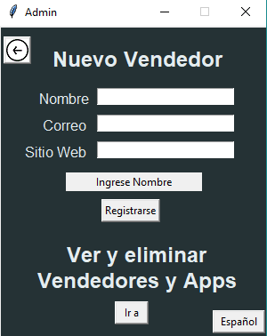

#AStore

La progra fue realizada en la version 3.6 de Python

Para acceder al modo administrador en la ventana de iniciar sesion ingrese, correo: admin y contrase�a: 1234
Para el modo vendedor ingrese en la ventana de inicio de sesion, correo: ID de vendedor y sin necesidad de contrase�a

En la carpeta DB estan los tres .txt solicitados y uno extra que utilice para los idiomas
En la carpeta img estan varias imagenes usadas por el programa y las de las aplicaciones(estas deben tener un tama�o aproximado de 300x150 en formato .gif) en el modo vendedor se agregar las imagenes de apps con el siguiente formato: img/nombre_de_la_imagen.gif 

El documento apps.txt esta separado por ";" y ordenado de la siguiente manera: IDapp; Nombre del app; IDvendedor; Estado; Precio; Imagen1; Imagen2; Descripcion; Descargas globales; Descargas en Costa Rica; Categoria(esta puede ser cualquier string, el buscador la reconocera)
El documento comprador.txt esta separado por "," y ordenado de la siguiente manera: IDcomprador, Nombre del comprador, Correo, Contrase�a, Pais(Costa Rica, Otro), Cantidad de descargas
El documento vendedores.txt esta separado por "," y ordenado de la siguiente manera: ID de vendedor, Nombre del vendedor, Correo del vendedor, Sitio Web del vendedor

Main Menu                  |  
:-------------------------:|
  |  

Data Base                  |  Login
:-------------------------:|:-------------------------:
  |  

Data Base                  |  Seller
:-------------------------:|:-------------------------:
  |  